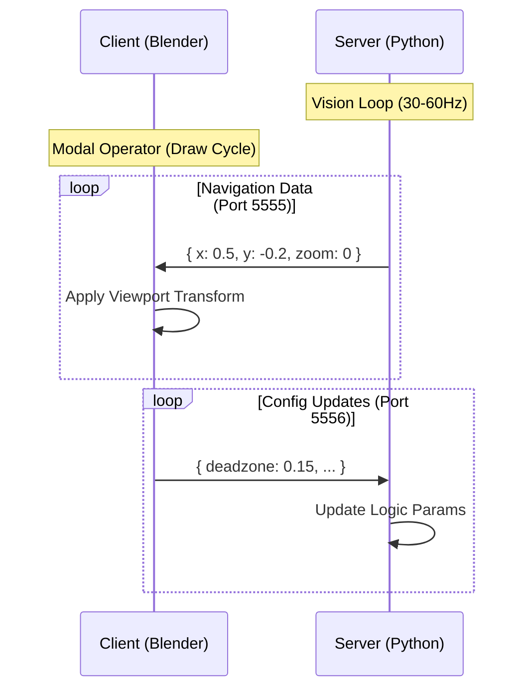

# **GestureNav Architecture (v1.7.0)**
> **The Blueprint**

This document details the technical implementation of GestureNav. It is intended for developers effectively maintain, debug, and extend the system.

---

## **1. High-Level Architecture**

GestureNav uses a **Decoupled Client-Server** pattern. The heavy computer vision workload runs in a separate process (Server) to ensure the 3D software (Client/Blender) remains responsive.

Communication is **Bidirectional** via local UDP sockets.



---

## **2. Threading Model**

A critical requirement for GestureNav is **Zero UI Freezing**. 

### **The Server (Multithreaded)**
The Python server uses standard `threading` to handle tasks concurrently:
1.  **Main Thread (Vision & Logic):** 
    *   Captures webcam frames.
    *   Runs MediaPipe inference.
    *   Calculates gestures.
    *   Sends UDP packets to Port 5555.
2.  **Listener Thread (Config):**
    *   Blocks/Listens on Port 5556 for incoming JSON configuration from Blender.
    *   Updates shared state variables safely.

### **The Client (Single-Threaded Modal Operator)**
Blender's Python API is primarily single-threaded. To receive data without freezing the UI, we use a **Modal Operator**.

*   **Modal Execution:** The operator runs every time Blender refreshes (Timer event).
*   **Non-Blocking I/O:** The UDP socket is set to `blocking(False)`.
    *   The operator attempts to read a packet.
    *   If data exists -> Parse & Apply.
    *   If no data (exception) -> Pass/Return immediately.
    
**Why this matters:** If we used a blocking socket or a standard `while True` loop in Blender, the entire interface would freeze until a packet arrived. The Modal/Non-blocking pattern keeps the interface fluid (60fps+) even if the server stalls.

---

## **3. Coordinate System & Math**

### **A. Normalization**
MediaPipe returns "Normalized Landmarks":
*   **X:** 0.0 (Left) to 1.0 (Right)
*   **Y:** 0.0 (Top) to 1.0 (Bottom)

We map the **Wrist Position** to this 0-1 space.

### **B. Centering**
We define a "Virtual Joystick Center" (default: `(0.5, 0.5)`).
Movement is calculated as the delta from this center:
$$ \Delta x = x_{wrist} - 0.5 $$
$$ \Delta y = y_{wrist} - 0.5 $$

### **C. The Deadzone**
To prevent drift when the hand is resting, we apply a circular deadzone.

**Algorithm:**
1.  Calculate Magnitude: $$ d = \sqrt{\Delta x^2 + \Delta y^2} $$
2.  **If** $ d < \text{DeadzoneRadius} $:
    *   Output = 0 (Stop)
3.  **If** $ d \ge \text{DeadzoneRadius} $:
    *   Subtract the deadzone radius from the magnitude so movement starts smoothly from 0.
    *   Scale the result by sensitivity.
    
    $$ \text{Speed} = \frac{d - \text{DeadzoneRadius}}{1.0 - \text{DeadzoneRadius}} \times \text{Sensitivity} $$

---

## **4. Data Protocol**

### **Packet Structure (Server -> Client)**
JSON payload sent continuously.
```json
{
  "state": "active",       // System Status
  "x": 0.55,               // Horizontal Orbit Speed (-1.0 to 1.0)
  "y": -0.21,              // Vertical Orbit Speed (-1.0 to 1.0)
  "zoom": 1                // 1 (In), -1 (Out), 0 (None)
}
```

### **Packet Structure (Client -> Server)**
JSON payload sent only on user change.
```json
{
  "deadzone_radius": 0.15,
  "zoom_thresh_in": 0.04,
  "orbit_sens": 2.5
}
```